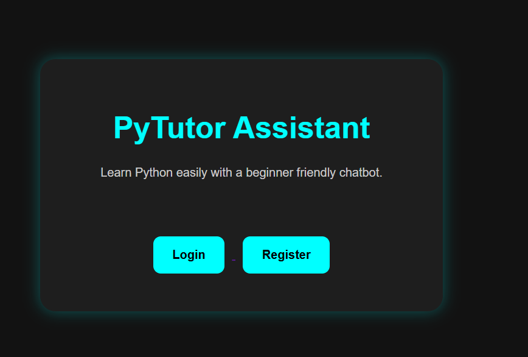
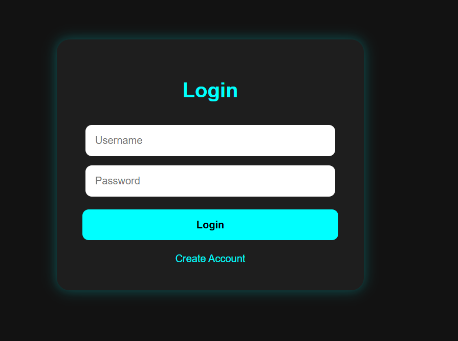
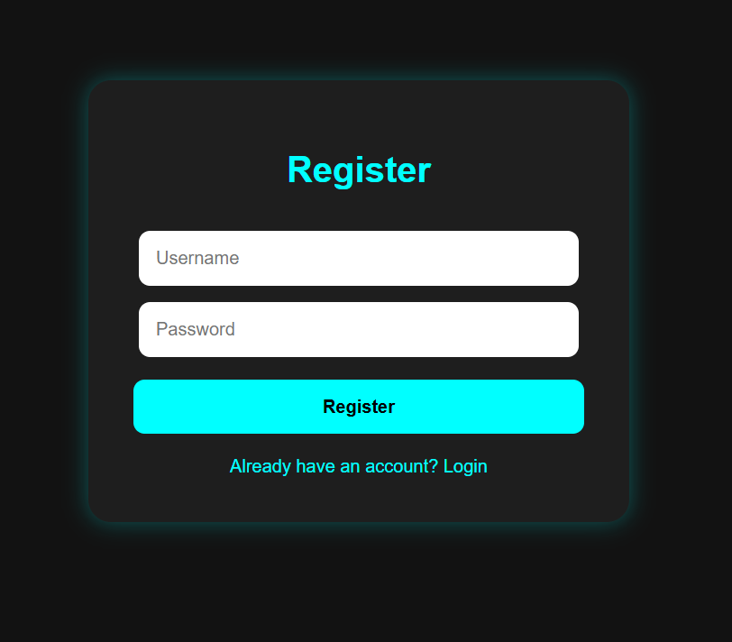
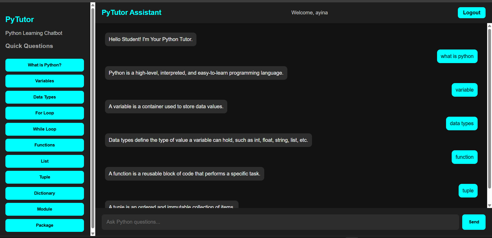

# 🐍 Python Chatbot

A web-based Python learning chatbot developed using Python and Flask. The chatbot accepts user inputs, identifies predefined intents, and provides simple responses to help beginners learn Python concepts.

## ✨ Features

- 💬 Interactive chatbot
- 🧠 Intent-based response system
- 🔐 User login and registration
- 🌐 Flask-based web application
- 🎨 HTML and CSS interface
- 📄 JSON-based chatbot intents
- 📚 Beginner-friendly Python learning topics
- ⚡ Simple and lightweight application

## 🛠️ Technologies Used

- Python
- Flask
- HTML
- CSS
- JSON

## 📂 Project Structure
```text
python_chatbot/
│
├── app.py
├── chatbot_engine.py
├── intents.json
├── requirements.txt
├── README.md
│
├── static/
│   └── style.css
│
├── templates/
│   ├── home.html
│   ├── index.html
│   ├── login.html
│   └── register.html
│
└── screenshots/
    ├── 01-home.png
    ├── 02-login.png
    ├── 03-register.png
    └── 04-chatbot.png
```


### 🏠 Home Page



### 🔐 Login Page



### 📝 Registration Page



### 💬 Chatbot Page



## ⚙️ How It Works

1. The user opens the Python Chatbot web application.
2. New users can create an account using the registration page.
3. Existing users can log in using their username and password.
4. After login, users can access the Python learning chatbot.
5. The chatbot accepts questions from the user.
6. User input is matched with predefined intents stored in intents.json.
7. The chatbot provides a response based on the matched intent.

## 🚀 How to Run

### 1. Clone the Repository

git clone https://github.com/ayinasara/python-chatbot.git

### 2. Open the Project Folder

cd python-chatbot

### 3. Install the Required Packages

pip install -r requirements.txt

### 4. Run the Application

python app.py

### 5. Open in Browser

Open this address in your browser:

http://127.0.0.1:5000/

## 🎯 Purpose

The purpose of this project is to provide a simple and beginner-friendly platform for learning Python concepts through an interactive chatbot.

The application combines a web-based interface with predefined chatbot intents to provide quick and easy explanations of basic Python topics.

## 🔮 Future Improvements

- Add more Python learning topics
- Improve chatbot responses
- Add more interactive learning features
- Add quizzes and practice questions
- Connect the chatbot to an AI-based response system